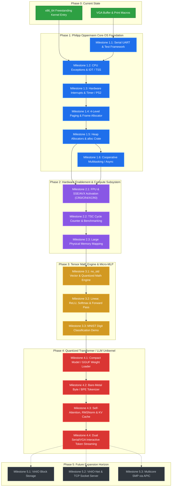

# 🗺️ tarOS Project Roadmap & Timeline

> **Mission**: Transform **tarOS** from an educational x86_64 bare-metal kernel into a high-performance **Bare-Metal AI Inference Unikernel** that executes quantized neural networks and transformer models directly on bare-metal hardware with zero operating system overhead.

---

## 🧭 Architectural Vision & Strategy

---

## 📌 Phase Overview & Status

| Phase | Title | Focus Area | Status |
|---|---|---|---|
| **Phase 0** | **Bootstrap & VGA Display** | Freestanding x86_64 binary, VGA driver, formatted printing | ✅ **Completed** |
| **Phase 1** | **Core Kernel Foundation** | Philipp Oppermann: IDT, PIC, Paging, Heap, Multitasking | ⏳ **In Progress** |
| **Phase 2** | **Hardware Compute Enablement** | FPU/SSE/AVX vector enablement, TSC timers, high-capacity memory | 📋 Planned |
| **Phase 3** | **Tensor Math & Micro-MLP** | Quantized matrix arithmetic, neural layers, MNIST classification | 📋 Planned |
| **Phase 4** | **Bare-Metal LLM Unikernel** | Quantized Transformer, KV cache, tokenizer, Serial/VGA streaming | 📋 Planned |
| **Phase 5** | **Storage, Network & SMP** | VirtIO disk streaming, smoltcp inference API, multicore APIC | 🔮 Future |

---

## Phase 0: Bootstrap & Text Mode (Completed)

- [x] **Freestanding x86_64 target specification** ([`x86_64-taros.json`](file:///D:/Project/tarOS/x86_64-taros.json)) with `panic-strategy = abort`, disabled red-zone, and `rust-lld`.
- [x] **Kernel entry point** ([`src/main.rs`](file:///D:/Project/tarOS/src/main.rs)): `_start` implementation booting via `bootloader = 0.9`.
- [x] **VGA Text Mode Driver** ([`src/vga_buffer.rs`](file:///D:/Project/tarOS/src/vga_buffer.rs)): Memory-mapped I/O at `0xb8000`, safe global state using `spin::Mutex`, `volatile` memory safety, color coding, scrolling, and custom `print!` / `println!` macros.

---

## Phase 1: Philipp Oppermann Core OS Foundation

Complete the full architectural suite of the ["Writing an OS in Rust"](https://blog.phil-opp.com/) series to establish a robust, fault-tolerant bare-metal kernel.

### Milestone 1.1: Serial Logging & Integration Testing Harness
- **Goal**: Enable headless debugging, automated host test runners, and dual output to both serial port (UART 16550) and screen.
- **Key Deliverables**:
  - `src/serial.rs`: Driver for UART 16550 at COM1 port (`0x3F8`) using the `uart_16550` crate.
  - `serial_print!` and `serial_println!` macros for non-visual and headless telemetry.
  - QEMU test exit device integration via `isa-debug-exit` (`0xf4` I/O port).
  - Integration test harness with custom test runner (`#![feature(custom_test_frameworks)]`).
- **Definition of Done**:
  - `cargo test` executes automatically inside QEMU and exits with status 0 upon test pass.
  - Kernel logs are duplicated or selectively routed to host terminal via `-serial stdio`.

### Milestone 1.2: CPU Exceptions & Interrupt Descriptor Table (IDT)
- **Goal**: Catch CPU faults cleanly (e.g. page faults, divide-by-zero, general protection faults) without triple faulting or crashing silently.
- **Key Deliverables**:
  - `src/interrupts.rs`: IDT initialization using `x86_64::structures::idt::InterruptDescriptorTable`.
  - Handlers for Breakpoint (`#BP`), Invalid Opcode (`#UD`), and Page Fault (`#PF`).
  - `src/gdt.rs`: Global Descriptor Table (GDT) and Task State Segment (TSS) setup.
  - Dedicated Interrupt Stack Table (IST) stack for Double Faults (`#DF`) to prevent stack-overflow triple-fault panics.
- **Definition of Done**:
  - Triggering an `x86_64::instructions::interrupts::int3()` prints a breakpoint diagnostic message and resumes execution.
  - A kernel stack overflow triggers the double fault handler on a dedicated stack and prints an informative panic rather than rebooting QEMU.

### Milestone 1.3: Hardware Interrupts & PS/2 Keyboard Driver
- **Goal**: Handle external asynchronous hardware interrupts (PIT timer and PS/2 keyboard).
- **Key Deliverables**:
  - Dual 8259 PIC (Programmable Interrupt Controller) remapping to offset `0x20..0x2F` to avoid Intel exception collisions.
  - Timer interrupt handler (IRQ 0) for kernel tick counting and time tracking.
  - PS/2 Keyboard interrupt handler (IRQ 1) reading scancodes from port `0x60`.
  - Scancode decoding via `pc-keyboard` crate (handling US-layout key events, Shift, Ctrl).
- **Definition of Done**:
  - Timer ticks fire periodically without hanging the system.
  - Keystrokes typed into the QEMU window appear immediately on the VGA screen.

### Milestone 1.4: 4-Level Paging & Memory Management
- **Goal**: Gain control over virtual and physical memory mappings via x86_64 4-level page tables.
- **Key Deliverables**:
  - `src/memory.rs`: Page table walking, virtual address to physical address translation.
  - Physical memory frame allocator leveraging the bootloader's passed `BootInfo` memory map.
  - Functionality to create new page table mappings dynamically (`map_to`).
- **Definition of Done**:
  - Resolving arbitrary virtual addresses (e.g., VGA buffer `0xb8000`) correctly displays their underlying physical frame.
  - Mapping a fresh unused virtual page to a physical frame succeeds and allows write/read verification.

### Milestone 1.5: Dynamic Heap Allocators & the `alloc` Crate
- **Goal**: Enable Rust's standard allocation types (`Box`, `Vec`, `String`, `Arc`, `BTreeMap`) in bare metal.
- **Key Deliverables**:
  - `src/allocator.rs`: Global allocator definition implementing `core::alloc::GlobalAlloc`.
  - Fixed-size heap region (e.g., 100 KB - 1 MB) mapped at a designated virtual memory address (e.g. `0x_4444_4444_0000`).
  - Progressive allocator implementations:
    1. Bump Allocator (fast, simple, no reclaim).
    2. Linked List Allocator (freed block merging, general purpose).
    3. Fixed-Size Block Allocator (high-speed allocations with minimal fragmentation).
  - External `extern crate alloc;` enabled throughout the kernel.
- **Definition of Done**:
  - Initializing `Vec<Box<u32>>` and allocating dynamically resized collections succeeds without kernel panic.
  - Automated tests verify allocation and deallocation across thousands of iterations without memory leaks.

### Milestone 1.6: Cooperative Multitasking & Async/Await
- **Goal**: Establish task scheduling and asynchronous event handling.
- **Key Deliverables**:
  - `src/task/`: Task abstraction wrapping Rust `Future<Output = ()>`.
  - Simple FIFO Executor and Waker implementation (`core::task::Waker`).
  - Asynchronous keyboard task consuming scancodes through a thread-safe `crossbeam-queue` / `ArrayQueue` without blocking the main CPU loop.
- **Definition of Done**:
  - The kernel runs an async event loop where background tasks and keyboard stream processing cooperate smoothly.

---

## Phase 2: Hardware Compute Enablement & AI Primitives

Prepare the x86_64 architecture for high-throughput arithmetic and numerical workloads by unlocking vector registers and establishing performance profiling.

### Milestone 2.1: FPU & SSE/AVX Vector Register Activation
- **Goal**: Enable floating-point and vector instructions (SSE2, AVX, AVX2) in kernel mode without triggering `#UD` or `#NM` exceptions.
- **Key Deliverables**:
  - Control register initialization in `src/cpu.rs`:
    - Configure `CR0`: Clear `EM` (Emulation) flag, set `MP` (Monitor Coprocessor) flag.
    - Configure `CR4`: Set `OSFXSR` (OS support for FXSAVE/FXRSTOR) and `OSXMMEXCPT` (OS unmasked SIMD floating point exceptions).
    - If CPUID supports AVX: Set `OSXSAVE` in `CR4` and enable `XCR0` bits (X87, SSE, AVX).
  - Context save/restore infrastructure (`fxsave64` / `xsave64`) if task preemption is utilized.
  - Compile-time/runtime verification that 128-bit/256-bit SIMD registers (`xmm0..15`, `ymm0..15`) can be populated and manipulated.
- **Definition of Done**:
  - Executing vector operations (e.g. `_mm256_add_ps` or compiled float/SIMD math) executes without CPU exceptions.

### Milestone 2.2: Cycle Counter & High-Resolution Benchmarking
- **Goal**: Microsecond- and CPU-cycle-accurate latency measurement for neural network layers.
- **Key Deliverables**:
  - `src/bench.rs`: RDTSC (Read Time-Stamp Counter) instruction wrapper (`core::arch::x86_64::_rdtsc`).
  - Timer calibration using the PIT/APIC to convert CPU cycles to elapsed milliseconds.
  - Scoped profiling macro `benchmark!("name", { ... })` that outputs cycle count and estimated time to Serial and VGA.
- **Definition of Done**:
  - Profiling a dummy 1,000,000-iteration loop outputs precise clock cycle metrics to Serial.

### Milestone 2.3: Memory Scaling & Physical Memory Mapping
- **Goal**: Scale heap and contiguous memory buffers from kilobytes to hundreds of megabytes/gigabytes to hold model parameters and KV caches.
- **Key Deliverables**:
  - Configure `bootloader` to pass the entire physical memory mapped at a known virtual offset (e.g., `physical_memory_offset`).
  - Frame allocator scaled to manage all available physical RAM detected from QEMU (e.g., configured with `-m 512M` or `-m 2G`).
  - Virtual address space allocation functions for large contiguous buffers (e.g., 64 MB tensor weight pools).
- **Definition of Done**:
  - Allocating a 32 MB contiguous array of parameters (`Vec<u8>` or custom Tensor buffer) succeeds and passes checksum validation.

---

## Phase 3: Bare-Metal Tensor Math Engine & Micro-MLP

Build an independent, `#![no_std]` mathematical engine capable of running a forward-pass multi-layer perceptron (MLP) for classification tasks.

### Milestone 3.1: `#![no_std]` Tensor Primitives & Quantized Math
- **Goal**: High-speed matrix multiplication and arithmetic without standard library dependencies.
- **Key Deliverables**:
  - `src/ai/tensor.rs`: N-dimensional lightweight `Tensor` struct (shape, stride, data buffer).
  - Integer Quantization primitives (INT8 quantization with scale and zero-point parameters).
  - Quantized Matrix Multiplication (`matmul_int8(A, B, C)`):
    - Baseline scalar implementation.
    - SIMD-accelerated dot-product routine (utilizing AVX2 / SSE vector registers).
- **Definition of Done**:
  - Unit tests verify matrix multiplication parity between scalar and SIMD routines with exact numerical tolerance.

### Milestone 3.2: Neural Network Layers & Activation Functions
- **Goal**: Core building blocks for deep learning inference.
- **Key Deliverables**:
  - `src/ai/layers.rs`:
    - Linear / Dense Layer: $y = xW^T + b$ (with INT8 weights and INT32/FP32 accumulation).
    - Activation functions: ReLU, GELU (polynomial approximation), and Softmax.
    - Argmax operation for classification output.
- **Definition of Done**:
  - A 3-layer sequential network produces verified mathematical outputs given deterministic test vectors.

### Milestone 3.3: First AI Milestone — Bare-Metal MNIST Classifier
- **Goal**: End-to-end bare-metal machine learning verification.
- **Key Deliverables**:
  - `src/ai/mnist.rs`: Pretrained 784 -> 128 -> 10 INT8 quantized MLP model embedded directly via `include_bytes!`.
  - Embedded sample 28x28 grayscale digits (e.g. handwritten "3", "7", "9").
  - Visual VGA rendering: Display the 28x28 digit as an ASCII art greyscale heatmap on the left side of the screen.
  - Prediction output: Display predicted digit, confidence distribution, and total inference cycles/latency on the right side and stream to Serial.
- **Definition of Done**:
  - Booting tarOS in QEMU runs the inference pipeline, prints the ASCII digit, correctly outputs the classification label, and logs cycle metrics.

---

## Phase 4: Bare-Metal Quantized Transformer / LLM Unikernel

Advance the compute engine to support modern transformer architectures (e.g., nanoGPT, SmolLM, or tiny LLaMA in quantized GGUF format).

### Milestone 4.1: Compact Weight Format & GGUF Parser
- **Goal**: Efficiently parse and load quantized transformer weights into bare-metal memory.
- **Key Deliverables**:
  - `src/ai/gguf.rs`: `#![no_std]` parser for GGUF / compact binary weight files.
  - Support for quantization formats: `Q4_0` (4-bit blocks with FP16 scale), `Q8_0`, and `FP32`.
  - Memory-mapping weights directly from a pre-loaded memory region (passed as an initrd/ramdisk or embedded asset).
- **Definition of Done**:
  - Successfully parses model metadata (tensor names, shapes, quantization types, layer count) and binds tensor pointers without copying data.

### Milestone 4.2: Bare-Metal Tokenizer
- **Goal**: Convert prompt strings to token IDs and generated token IDs back to human-readable text.
- **Key Deliverables**:
  - `src/ai/tokenizer.rs`: `#![no_std]` Byte-level / BPE (Byte Pair Encoding) tokenizer.
  - Vocabulary lookup table stored compactly in memory.
  - Decode function: streaming single token IDs to UTF-8 characters as they are sampled.
- **Definition of Done**:
  - String prompt `"The quick brown fox"` tokenizes to expected token sequence and decodes back to the identical string.

### Milestone 4.3: Transformer Forward Pass & KV Cache Management
- **Goal**: Full autoregressive transformer inference pipeline.
- **Key Deliverables**:
  - `src/ai/transformer.rs`:
    - RMSNorm / LayerNorm normalization.
    - Rotary Positional Embeddings (RoPE).
    - Multi-Head Attention / Grouped-Query Attention (GQA).
    - Pre-allocated static Key-Value (KV) Cache in heap memory.
    - SwiGLU / MLP feed-forward block.
    - Temperature and top-k / greedy token sampling.
- **Definition of Done**:
  - Given a single token prompt, the transformer calculates logits, samples the next token, updates the KV cache, and repeats for $N$ steps.

### Milestone 4.4: Dual Serial/VGA Interactive Generation Loop
- **Goal**: Interactive, real-time LLM execution interface over Serial UART and VGA.
- **Key Deliverables**:
  - Serial port prompt listener: Accepts text prompts transmitted over COM1 serial port from host scripts or terminal.
  - Token streaming engine: As each token is generated, its text representation is immediately pushed to:
    1. COM1 Serial (for automated logging / piping to host tools).
    2. VGA text buffer (with live cursor update and automatic scrolling).
  - Benchmark footer: Prints tokens-per-second, time-to-first-token, and peak memory usage.
- **Definition of Done**:
  - Typing a prompt via serial or running an automated QEMU script triggers live token-by-token text generation displayed smoothly on both screen and serial terminal.

---

## Phase 5: Future Expansion Horizon (Post-Unikernel)

Long-term extensions for production deployments, hardware acceleration, and scale.

- [ ] **Milestone 5.1: VirtIO-Block Driver**: Stream large multi-gigabyte models directly from virtual hard disks instead of loading the entire model into RAM at boot.
- [ ] **Milestone 5.2: VirtIO-Net & Bare-Metal REST API**: Integrate `smoltcp` to expose an HTTP/TCP socket endpoint, allowing external machines to query the unikernel like an OpenAI-compatible API server.
- [ ] **Milestone 5.3: Multicore SMP (Symmetric Multiprocessing)**: Initialize secondary CPU cores via Local APIC and IPI (Inter-Processor Interrupts) to parallelize matrix multiplications across multiple virtual CPU threads.

---

## 🛠️ Verification & Acceptance Matrix

| Milestone | Key Verification Command | Expected Output / Criteria |
|---|---|---|
| **1.1 (Serial/Test)** | `cargo test --target x86_64-taros.json` | QEMU runs headlessly, outputs test passes to stdout, exits with status 0 |
| **1.2 (IDT/TSS)** | `cargo run` (with test breakpoint) | `#BP` handler catches breakpoint without reboot or panic |
| **1.3 (Interrupts)** | `cargo run` (interactive QEMU) | Typing keys prints corresponding characters to VGA screen |
| **1.4 (Paging)** | `cargo run` (memory test) | Successfully creates page table mapping and verifies physical frame |
| **1.5 (Heap)** | `cargo run` (alloc test) | `Vec::new()`, `Box::new()` allocate and free dynamically without leak |
| **1.6 (Async)** | `cargo run` (executor test) | Async keyboard task handles input stream without blocking loop |
| **2.1 (FPU/SIMD)** | `cargo run` (SIMD test) | Vector instruction (`_mm256_add_ps` / float math) executes without `#UD` |
| **2.2 (Benchmarking)**| `cargo run` (timer test) | RDTSC cycle measurements print accurate elapsed time to Serial |
| **2.3 (Large Memory)**| `cargo run -m 512M` | Heap successfully manages 64+ MB contiguous buffers |
| **3.1 (Quant Math)** | `cargo test` (matmul test) | Scalar and SIMD INT8 dot products match with exact numerical values |
| **3.2 (NN Layers)** | `cargo test` (layer test) | Dense layer + ReLU output matches reference PyTorch/NumPy vectors |
| **3.3 (MNIST)** | `cargo run` | ASCII digit renders on VGA; prediction label matches test image |
| **4.1 (Weight Loader)**| `cargo run` (GGUF test) | Correctly parses tensor headers, shapes, and quantization metadata |
| **4.2 (Tokenizer)** | `cargo test` (tokenizer) | Exact round-trip tokenization for test strings |
| **4.3 (Transformer)** | `cargo run` (inference test) | Multi-step autoregressive forward pass produces coherent tokens |
| **4.4 (Streaming)** | `cargo run` (prompt run) | Real-time token streaming to COM1 serial and VGA with tokens/sec report |
